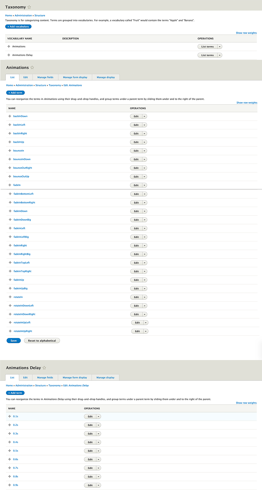

# *Add to the subtheme.libraries.yml*

#Half and Half  
half_and_half:  
version: "1.0.x"  
css:  
theme:  
//cdnjs.cloudflare.com/ajax/libs/animate.css/4.1.1/animate.min.css: { type: external }  
templates/block/custom/half_and_half/css/half_and_half.css: {}  
js:  
//cdnjs.cloudflare.com/ajax/libs/waypoints/4.0.1/jquery.waypoints.min.js: { type: external }  
templates/block/custom/half_and_half/js/waypoint.js: {}  
dependencies:  
- core/jquery  

# *Add to the repositories section in subtheme composer.json*

"repositories": [  
{  
"type": "vcs",  
"url": "https://github.gatech.edu/ICWebTeam/block_half_and_half.git"  
}
# *Add to the require in subtheme composer.json*

"require": {  
"gt/half_and_half": "dev-master"  
"mnsami/composer-custom-directory-installer": "^2.0" 
},

# *Add to the installer paths in subtheme composer.json*
"installer-paths": {  
"web/themes/custom/SUBTHEME/templates/block/custom/half_and_half": [  
"gt/half_and_half"  
]  
},

# *Implements hook_page_attachments_alter(). in subtheme.theme*
function tlw_page_attachments_alter(&$page) { 
$page['#attached']['library'][] = 'SUBTHEME/half_and_half'; 
}

# **TAXONOMY SET-UP**

